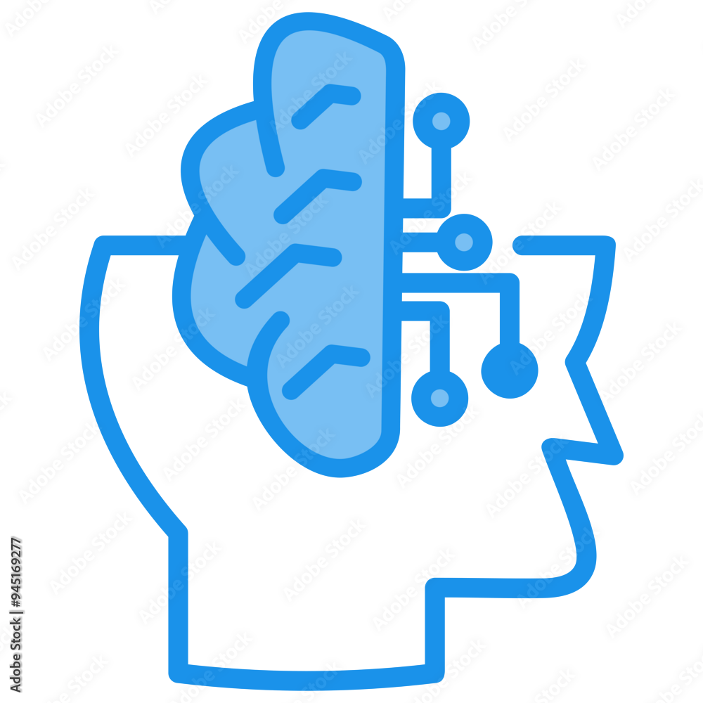

# AI Intelligent System


An advanced, customizable AI Intelligent Systems Prototype application developed using CustomTkinter, TensorFlow, OpenCV, Pandas, and other key technologies for machine learning,  image processing, and more. The project provides tools to upload datasets, train models, make predictions, process images, and deploy AI models via FastAPI.
---

## Features

- **Upload Dataset**: Easily upload CSV or Excel files for training.
- **Train AI Models**: Train TensorFlow-based models on your data with a single click.
- **Make Predictions**: Test the trained model on new data.
- **Image Processing**: Perform optimization and apply 3D transformations to images.
- **Model Deployment**: Deploy your trained model via FastAPI for easy integration with other services.
- **User Management**: Leverages SQLite for storing user data.
- **3D Visualizations**: Optional support for 3D plots using Plotly.
- **Advanced Settings**: Customize the AI behavior including mathematical modes, sentiment analysis thresholds, and data sources.
- **TensorFlow and PCA**: Use deep learning and dimensionality reduction techniques for machine learning tasks.

---

## Prerequisites

Ensure you have the following software installed before proceeding:
- Python 3.9+
- SQLite (included with Python)
- Git (for version control)

## Setup

1. **Clone the Repository**:
   Clone this repository to your local machine:
   ```bash
   git clone https://github.com/kayung-developer/ai-intelligent-system.git
   cd ai-intelligent-system
   ```
2. **Set up a virtual environment (optional but recommended)**:
```bash
python -m venv venv
source venv/bin/activate  # On
```
3. **Install required packages**:
```bash
pip install -r requirements.txt
```


# Dependencies
Make sure you have the following installed:
**Python 3.x**
**CustomTkinter**
**TensorFlow**
**OpenCV**
**Pandas**
**NumPy**
**TextBlob**
**Werkzeug**
**SQLite**
**FastAPI**
**Uvicorn**

Check the requirements.txt for the recommended versions of each package.
## Usage
**To run the AI Intelligent System, execute the following command**:
```bash
python app.py
```
## Here’s how to use the system for [specific task or function]:

```bash
from ai_intelligent_system import AIModel
```
# Initialize the model
```bash
model = AIModel()
```
# Example usage
```bash
result = model.predict(data)
print(result)
```
## Usage
Upload a Dataset: Use the "Upload Dataset" button to load CSV or Excel files for training. The system supports multiple file formats for data processing.

Train a Model: Click on the "Train Model" button to initiate training using TensorFlow on your dataset. The system will process the data and train a model based on the input.

Make Predictions: Once the model is trained, use the "Predict" button to test the AI model on new data and get predictions.

Image Processing: Select an image file, and the system will perform image optimization and apply 3D transformations for visualization and analysis.

Deploy the Model: Deploy your AI model via FastAPI by clicking the "Deploy Model via FastAPI" button. This will expose the trained model via an API endpoint for easy integration.


## Support
**If you encounter any issues or have questions, please open an issue on this repository or contact us at [princelillwitty@gmail.com].**

## Development
**We welcome contributions to the AI Intelligent System project! To contribute**


## Future Advancements:

- Advanced Model Integration: Add ResNet, EfficientDet, and more models.

- Gesture Recognition & Voice Control: Hands-free AI interaction.

- Facial Recognition & Emotion Analysis.

- Data Logging & Reports Export.

- Cross-Device Synchronization & Augmented Reality (AR) integration.
  

## Cross-Platform Accessibility:

- Windows & Mac: Use PyInstaller for standalone apps.

- Linux: Create .deb or .rpm packages.

- iOS/Android: Port using Kivy or BeeWare.

- Cloud: Deploy on AWS, Azure, or GCP for global access.

- Web: Build a web app with Flask/Django & TensorFlow.js

These upgrades will enhance functionality and make the software accessible on any platform.


## Screenshots
**Here are some of a few screenshots of the application**:

| Feature            | Screenshots                                     |
|--------------------|-------------------------------------------------|
| Main Interface      |       |
| Image Processing    |           |
| Settings Page       |  |

**Check Screenshot folder for all images**
