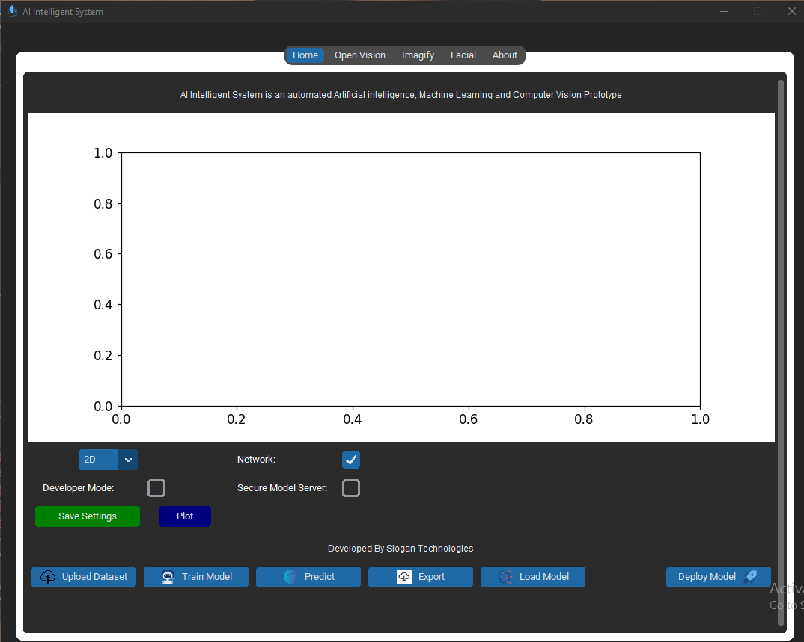
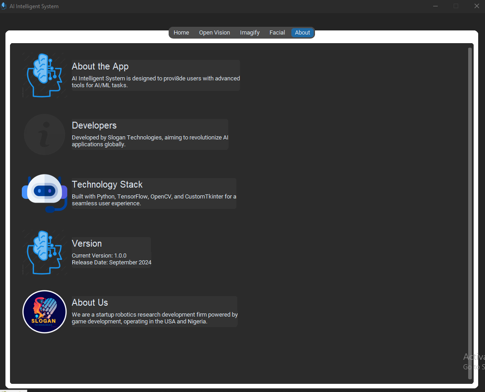
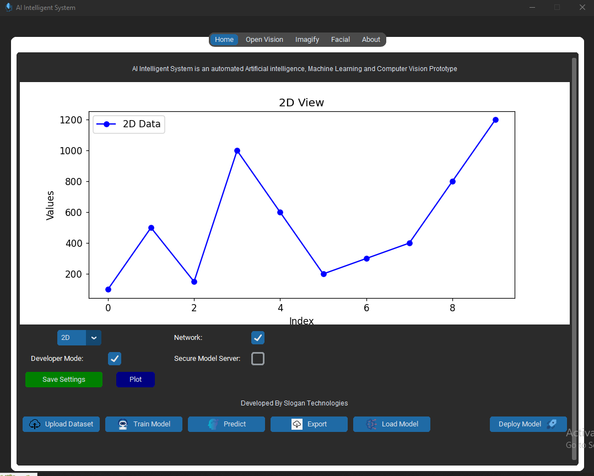
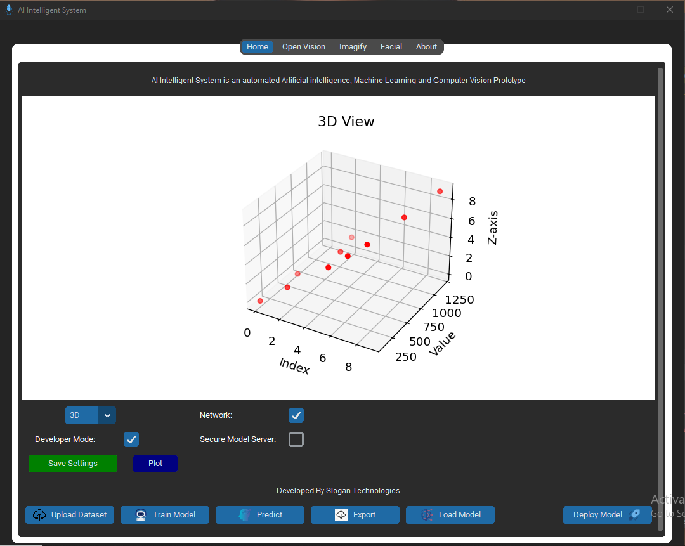
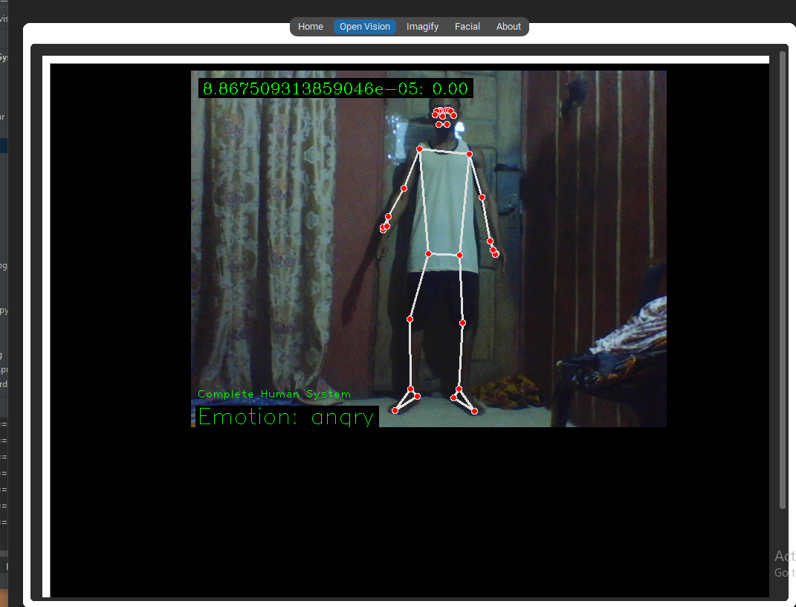
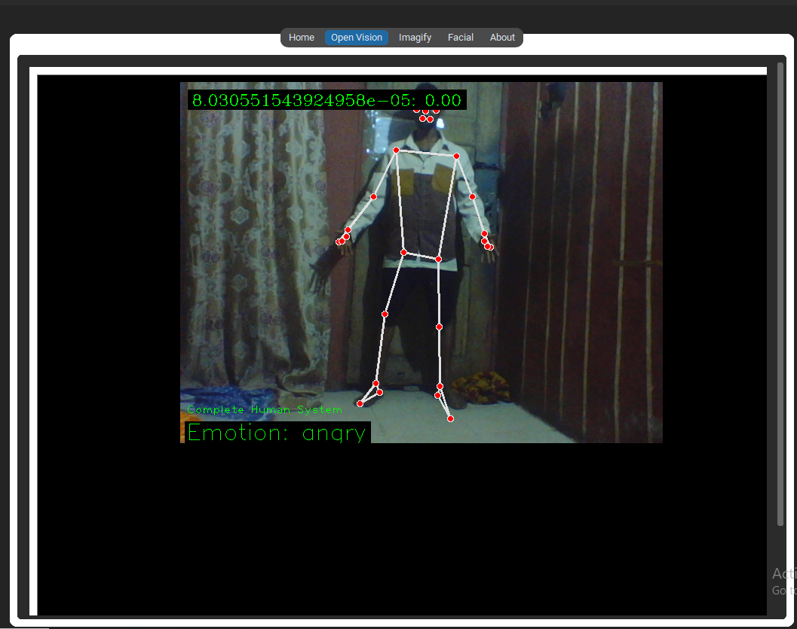
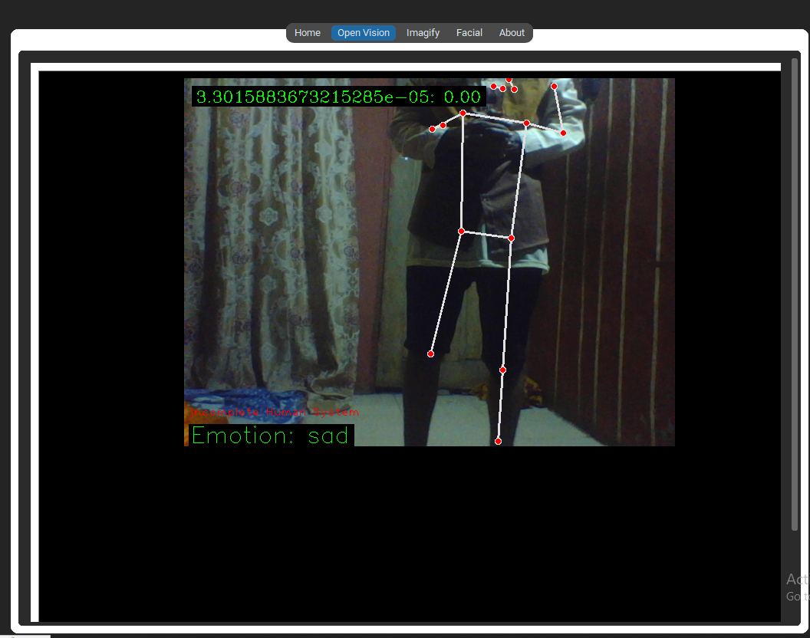
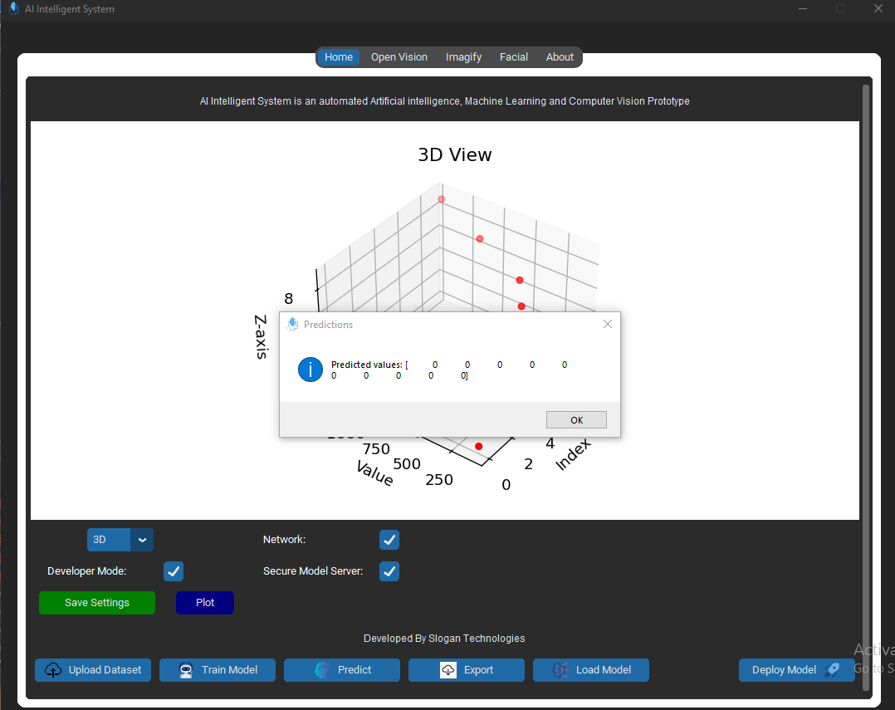

# AI Intelligent System

## Overview
AI Intelligent System is a sophisticated application that integrates artificial intelligence (AI), machine learning (ML), and computer vision to perform advanced data processing, object detection, facial recognition, and human pose estimation. The system leverages modern deep learning models and cutting-edge frameworks such as TensorFlow, PyTorch, MediaPipe, and YOLOv5.

---

## Features
- **User Authentication**: Secure login and registration with hashed passwords and profile management.
- **Object Detection**: Supports MobileNetV2, YOLOv5, and ResNet50 for object detection.
- **Facial Recognition**: Detects faces and analyzes emotions using DeepFace and Haar cascades.
- **Pose Estimation**: Utilizes MediaPipe for real-time human pose detection.
- **Dataset Management**: Upload, train, and predict using custom datasets.
- **Model Deployment**: Deploy models and visualize results in 2D or 3D.
- **Custom GUI**: Built with CustomTkinter for an enhanced user experience.
- **Media Recording**: Record video streams, save images, and export analysis results.
- **Multi-Model Support**: EfficientNet, Faster-RCNN (soon), and EfficientDet (soon).

---

## Installation
### Requirements
- Python 3.8 or higher
- TensorFlow
- PyTorch
- OpenCV
- Pandas
- Numpy
- Matplotlib
- CustomTkinter
- DeepFace
- Mediapipe

### Setup
1. Clone the repository:
   ```bash
   git clone https://github.com/kayung-developer/ai-intelligent-system.git
   ```
2. Navigate to the project directory:
   ```bash
   cd ai-intelligent-system
   ```
3. Install required dependencies:
   ```bash
   pip install -r requirements.txt
   ```
4. Download YOLOv5 model:
   ```bash
   torch.hub.load('ultralytics/yolov5', 'yolov5s', device='cpu', pretrained=True)
   ```

---

## How to Run
1. Launch the main application:
   ```bash
   python app.py
   ```
2. The application GUI will open, allowing access to different AI modules through the tab view.

---

## Application Structure
```
.
|-- app.py           # Main application GUI
|-- main.py          # HomeFrame - Handles dataset upload, model training, and visualization
|-- vision.py        # VisionFrame - Real-time video processing and object detection
|-- assets/          # Icons and image assets
|-- about/           # AboutFrame - Information and documentation
|-- medical/         # MedicalFrame - Healthcare-related AI models
|-- finance/         # FraudFrame - Financial fraud detection
|-- user_data.db     # SQLite Database for user management
|-- requirements.txt # List of dependencies
```

---

## Key Components
### app.py
- Initializes the CustomTkinter-based GUI.
- Handles user authentication, menu navigation, and network management.
- Dynamically loads frames for object detection, vision processing, and facial recognition.

### main.py
- Contains the `HomeFrame` class for managing datasets, model training, and plotting.
- Supports both 2D and 3D data visualization.

### vision.py
- Implements the `VisionFrame` class to manage camera streams, detect objects, and analyze human poses in real-time.
- Supports video recording and saving images from camera streams.

---

## Usage
1. **Upload Dataset** - Click on "Upload Dataset" to load a CSV file.
2. **Train Model** - Train a custom neural network model using the uploaded dataset.
3. **Object Detection** - Use the camera to detect objects and draw bounding boxes.
4. **Pose Estimation** - Detect human poses and overlay landmarks on the video feed.
5. **Facial Recognition** - Identify faces and display emotions.
6. **Deploy Model** - Deploy trained models to a local server.

---

## Screenshots









![]
---

## Future Enhancements
- **EfficientDet Integration**
- **Faster-RCNN Support**
- **Augmented Reality (AR) Module**
- **Multi-Person Tracking**

---

## Acknowledgements
- [YOLOv5 by Ultralytics](https://github.com/ultralytics/yolov5)
- [TensorFlow](https://www.tensorflow.org/)
- [PyTorch](https://pytorch.org/)
- [MediaPipe](https://mediapipe.dev/)
- [DeepFace](https://github.com/serengil/deepface)

---

## License
This project is licensed under the MIT License - see the LICENSE file for details.

